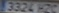
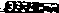

# Práctica 4 - Detección de Matrículas con YOLO

Práctica realizada por el grupo 15 (Lucía Motas Guedes y Raúl Marrero Marichal).

Este proyecto implementa un **sistema de detección y seguimiento de personas y vehículos** mediante **YOLOv8/YOLO11** y el framework **Ultralytics**, con capacidad para:
- Detectar y seguir vehículos y personas en vídeo.  
- Detectar matrículas en vehículos mediante un modelo entrenado propio.  
- Anonimizar personas y matrículas en la visualización final.  
- Generar un **CSV con los resultados** de detección y seguimiento.  
- Calcular el **flujo direccional** (arriba/abajo) de personas y vehículos.

---

## Estructura del Proyecto

```bash
├── dataset/ # subido a onedrive
│ ├── train/
│ │ ├── images/
│ │ └── labels/
│ ├── val/
│ │ ├── images/
│ │ └── labels/
│ └── test/
│ ├── images/
│ └── labels/
│
├── data.yaml
├── yolo_runs/
│ └── plates_detection/ # Carpeta generada tras entrenamiento del detector de matrículas
│ └── weights/
│ └── best.pt
├── output_ocr/ # Carpeta con los resultados de las pruebas con OCR e imágenes de ejemplo
│ └── dataset_output.csv
│ └── smolVLM_output.csv
│ └── tesseract_output.csv
│ └── p4_results_tesseract.csv
│ └── testimg.jpg
│ └── testimg2.jpg
│ └── testtresh.jpg
│ └── testtresh2.jpg
├── VC_P4.ipynb # Cuaderno con la resolución de la primera parte de la práctica
├── VC_P4b.ipynb # Cuaderno con la resolución de la segunda parte (OCR)
├── C0142.mp4 # Vídeo de test (enlace externo)
├── p4_output.mp4 # Vídeo resultante con detecciones (enlace externo)
├── p4_results.csv # Resultados de detección y tracking
└── README.md
```
> Nota: Los vídeos no han sido incluidos en el repositorio porque superan el tamaño permitido y el dataset se encuentra disponible en google drive.

---

## 1. Configuración del Entorno

Requiere un entorno Python con soporte CUDA (En nuestro caso: CUDA 12.7).

* Instalar Python 3.9.5.
* Ejecutar los siguientes comandos en una terminal, con permisos de administrador.

### Instalación paso a paso

```bash
# === Crear el entorno virtual ===
python -m venv VC_P4

# === Activar el entorno ===
.\VC_P4\Scripts\activate

# === Instalar PyTorch compatible con CUDA 12.x ===
pip install torch torchvision torchaudio --index-url https://download.pytorch.org/whl/cu121  # o cu126

# === Instalar Ultralytics (YOLOv11) ===
pip install ultralytics

# === Instalar OpenCV ===
pip install opencv-python

# === Instalar lap (para el tracking en YOLO) ===
pip install lap
```

---

## 2. Entrenamiento del Modelo para Detectar Matrículas

Una vez recopiladas y anotadas las imágenes, se deben organizar correctamente antes del entrenamiento con YOLO.

### Estructura de datos

```
dataset/
├── images/
└── labels/
```

* `images/`: contiene las imágenes de entrada.
* `labels/`: contiene los archivos `.txt` homónimos con las anotaciones.

Cada archivo `.txt` contiene las anotaciones en formato YOLO:

```
<object-class-id> <x> <y> <width> <height>
```

Donde:

| Campo             | Descripción                                                        |
| ----------------- | ------------------------------------------------------------------ |
| `object-class-id` | Identificador numérico de la clase (por ejemplo, `0` para “plate”). |
| `x`, `y`          | Coordenadas del **centro del contenedor**, normalizadas.            |
| `width`, `height` | Dimensiones del contenedor, también normalizadas.                   |

---

### División del dataset (Subido a Onedrive)

Se disponía de 691 imágenes y se realizó una división aleatoria mediante el script `divide.py`:

| Conjunto      | Porcentaje | Nº de imágenes |
| ------------- | ---------- | -------------- |
| Entrenamiento | 70%        | 483            |
| Validación    | 20%        | 138            |
| Test          | 10%        | 70             |

---

### Archivo `data.yaml`

El archivo de configuración `data.yaml` define las rutas del dataset y las clases:

```yaml
train: dataset/train/images
val: dataset/val/images
test: dataset/test/images

nc: 1
names: ['plate']
```

---

### Entrenamiento

El entrenamiento puede realizarse tanto en **CPU** como en **GPU**:

```bash
# === CPU ===
yolo detect train data=data.yaml model=yolo11n.pt imgsz=416 batch=4 device=cpu epochs=40 project=yolo_runs name=plates_detection exist_ok=True

# === GPU ===
yolo detect train data=data.yaml model=yolo11n.pt imgsz=416 batch=4 device=0 epochs=40 project=yolo_runs name=plates_detection exist_ok=True
```

---

### Validación y Predicción

```bash
# Validación
yolo detect val model=yolo_runs/plates_detection/train/weights/best.pt data=data.yaml

# Predicción sobre imágenes o vídeo
yolo detect predict model=yolo_runs/plates_detection/weights/best.pt source=dataset/test/images/
yolo detect predict model=yolo_runs/plates_detection/weights/best.pt source="C0142.mp4"
```


## 3. Detección, Seguimiento y Anonimización

El cuaderno `VC_P4.ipynb` realiza todo el pipeline de detección y seguimiento.

### Funcionalidades

* Detecta **personas y vehículos** con el modelo general `yolo11n.pt`
* Detecta **matrículas** con el modelo entrenado `best.pt`
* Realiza **tracking persistente** para mantener el `track_id`
* **Anonimiza** personas y matrículas pixelando la región de interés (`cv2.INTER_LINEAR, cv2.INTER_NEAREST`)
* Genera:

  * Un vídeo procesado (`p4_output.mp4`)
  * Un CSV con todas las detecciones (`p4_results.csv`)
> Nota: Los IDs de clase corresponden a las categorías preentrenadas de YOLO basadas en COCO: persona, bicicleta, coche, moto, bus y camión.

---

### Formato del CSV generado

Si detecta matrícula:
| frame | tipo_objeto | confianza | track_id | x1  | y1  | x2  | y2  | plate | plate_conf | mx1 | my1 | mx2 | my2 |
| ----- | ----------- | --------- | -------- | --- | --- | --- | --- | ----- | ---------- | --- | --- | --- | --- |
| 10    | car         | 0.89      | 2        | 120 | 310 | 280 | 420 | Si    | 0.93       | 140 | 360 | 250 | 400 |


Si no detecta matrícula:
| frame | tipo_objeto | confianza | track_id | x1 | y1  | x2  | y2  | plate | plate_conf | mx1 | my1 | mx2 | my2 |
| ----- | ----------- | --------- | -------- | -- | --- | --- | --- | ----- | ---------- | --- | --- | --- | --- |
| 27    | person      | 0.78      | 5        | 56 | 234 | 134 | 346 | No    | ,          | ,   | ,   | ,   | ,   |

- Luego se genera un CSV con el **conteo de objetos** (`p4_conteo_clases.csv`), sin repeticiones por track_id, para evitar contar varias veces el mismo vehículo o persona.

---

## 4. Análisis del Flujo Direccional

El análisis del **flujo vertical (arriba / abajo)** se realiza en tiempo real durante la inferencia, usando el **tracking persistente de YOLO**.
Cada entidad detectada mantiene un `track_id` único que permite conocer su trayectoria a lo largo de los fotogramas.

---

### Lógica del proceso

1. **Cálculo del centro del objeto**
   Para cada detección válida (persona o vehículo), se calcula el centro del contenedor:

   ```python
   cy = (y1 + y2) // 2
   cx = (x1 + x2) // 2
   ```

   Este punto representa la posición media del objeto en el frame.

2. **Registro histórico del movimiento**
   Se almacena la secuencia de centros por `track_id`:

   ```python
   track_history[track_id].append((cx, cy))
   ```

   Así se puede conocer el desplazamiento vertical (cy) de cada entidad a lo largo del vídeo.

3. **Determinación de dirección de flujo**
   Una vez que un objeto **desaparece del frame** (ya no está presente en `current_ids`), se compara su posición inicial y final:

   ```python
   cy_first = track_history[track_id][0][1]
   cy_last  = track_history[track_id][-1][1]
   ```

   Y se evalúa el sentido de movimiento:

   * ⬆️ **Arriba** → `cy_last < cy_first`
   * ⬇️ **Abajo** → `cy_last > cy_first`
   * ⏹️ **Estático** → desplazamiento menor que un umbral (movimiento mínimo o ruido)

---

### Umbrales de salida

Para evitar falsos positivos cuando un objeto aún está dentro del área visible, se definen **zonas de salida** en la parte superior e inferior del vídeo:

```python
top_exit_threshold = int(height * 0.05)
bot_exit_threshold = height - top_exit_threshold
```

Si el centro vertical (`cy`) de un objeto cruza uno de estos umbrales, se interpreta como **salida del frame**:

```python
if centers[-1][1] <= top_exit_threshold:
    direction = "arriba"
elif centers[-1][1] >= bot_exit_threshold:
    direction = "abajo"
```

Esto garantiza que solo se contabilizan los objetos que realmente **salen** del vídeo por alguno de los bordes.
Durante la ejecución, los conteos se muestran **frame a frame** superpuestos sobre el vídeo, y al finalizar se dispone del **conteo total acumulado por clase y dirección**.

> Nota: cy representa el centro vertical del objeto en el frame.
> Como la cámara está fija y la escena principal tiene movimiento de personas y vehículos subiendo o bajando en la imagen, interesa el desplazamiento vertical, no horizontal.
> Esto permite decir si un objeto “entra” desde abajo o “sale” hacia arriba del frame.
> Si se quisiera obtener el flujo horizontal, se haría con cx (por ejemplo, tráfico de carriles grabado de lado).

---

## 5. Videos

### Video de test
([Enlace al video](https://alumnosulpgc-my.sharepoint.com/personal/mcastrillon_iusiani_ulpgc_es/_layouts/15/stream.aspx?id=%2Fpersonal%2Fmcastrillon%5Fiusiani%5Fulpgc%5Fes%2FDocuments%2FRecordings%2FC0142%2EMP4&ga=1&referrer=StreamWebApp%2EWeb&referrerScenario=AddressBarCopied%2Eview%2E46ab14ca%2D810e%2D4502%2Db4e6%2D24d9e9c97e7e))

### Video procesado (Anonimización)
<p align="center">
  <a href="https://www.youtube.com/watch?v=66cw3o4lElE" target="_blank">
    
  </a>
</p>

# Práctica 4b – Reconocimiento de texto en matrículas (OCR)

En la segunda parte de la práctica (P4b) se amplia el sistema para incluir **reconocimiento de texto (OCR)** en las matrículas, comparando:

* **Tesseract**
* **SmolVLM** (modelo de lenguaje visual)

Esta parte se desarrolla en el cuaderno `VC_P4b.ipynb`.

### Tesseract

Tesseract se trata de una red neuronal clásica que se usa en esa práctica para realizar el reconocimiento de caracteres de las matrículas. La función 'readPlateOCR' es la encargada de leer una imagen usando Tesseract.

El modelo es bastante limitado y en las primeras pruebas no era capaz de detectar el texto de las imágenes completas del dataset, por lo que primero, se realiza un tratamiento de cada imagen antes de llamar a la función de reconocimiento de texto.

Dicho tratamiento consiste en localizar la matrícula usando el modelo de YOLO ya entrenado y así reducir enormemente el tamaño de la imagen que debe procesar Tesseract, mejorando notablemente su precisión y el tiempo de procesado. Además, se realiza un umbralizado para que resulte más sencilla la lectura de caracteres.


Tras ello, se hace una detección de bordes sobre la imagen umbralizada para tratar de separar cada caracter y se le pasa cada detección individualmente Tesseract. Concatenando todas las detecciones, se obtiene el resultado final.

Se ha decidido hacer las detección de manera individual para cada caracter debido a que durante las primeras pruebas, el modelo era incapaz de leer satisfactoriamente la matrícula. Esto podría ser por la posibilidad de que Tesseract intentase leer palabras completas en lugar de números y caracteres inconexos. En cualquier caso, los resultados mejoraron notablemente tras aplicar esta técnica.

### SmolVLM

Este modelo se trata de un VLM (Modelo de Lenguaje Visual) mucho más complejo que Tesseract, anteriormente mencionado. El uso de este modelo tiene sus propias ventajas y desventajas respecto a los OCR clásicos.

Su principal ventaja es que las imágenes no deberían necesitar un tratamiento tan complejo como los OCR, simplificando enormemente la tarea de preparación del programa ejecutable, y en teória debería dar mejores resultados al ser un modelo notablemente más potente y versátil.

Sin embargo, sus desventajas son muy claras. En el apartado técnico, el modelo ocupa mucho más en el almacenamiento y requiere de un hardware mucho más potente para funcionar, siendo el uso de una GPU prácticamente obligatorio para su funcionamiento con un tiempo de inferencia razonable. Además, como muchos VLM, su output es muy impredecible, lo que complica notablemente su tratamiento, además de que puede dar lugar a errores en el filtrado de la salida al no respetar el formato indicado en el prompt, o directamente haciendo caso omiso de las instrucciones dadas.

Tras probar con varios prompts, el que mejor resultados dió y por tanto el utilizado por el programa, es el siguiente:
```json
{
    "role": "user",
    "content": [
        {"type": "image"},
        {"type": "text", "text": "Read the text in the image and answer only with 'Text: <the text>' even if there is no text:"}
    ]
},
```
A pesar de indicar claramente el formato de salida, en muchas ocasiones, dicha salida es '<the text>' en lugar del propio texto leído. No se logró un formato de salida consistente a pesar de múltiples intentos de simplificar o detallar el prompt.

Al igual que con Tesseract, se pasa por parámetro a la función 'readPlateVLM' la imagen reducida, incluyendo únicamente la matrícula a leer detectada por YOLO.

## Comparativa con el dataset de entrenamiento

Para realizar la comparativa entre ambos métodos (Tesseract y SmolVLM), se hace uso del dataset 'plates' usado para el entrenamiento del modelo YOLO. Se ha usado una versión reducida del dataset con únicamente 84 imágenes, que se consideran suficientes para reflejar el comportamiento de ambos modelos sin que suponga un tiempo de espera excesivo.

El dataset incluye múltiples versiones de la misma imagen, modificando su rotación, color o añadiendo ruido, para así poder observar el comportamiento de cada modelo ante diferentes situaciones.

El resultado de cada ejecución está recogido en los archivos 'tesseract_output.csv' y 'smolVLM_output.csv', fácilmente diferenciables. Estos archivos de salida tienen el mismo formato y tienen columnas diferenciando cada modelo, aunque sólo se utilice uno durante esa ejecución. Esto es así para facilitar el tratamiento de los datos en caso de usar ambos modelos a la vez.

También se hizo una prueba simultánea con el dataset completo, pero hubo que detenerla antes de tiempo debido a que el tiempo de ejecución era demasiado elevado. Igualmente, los resultados recogidos están en el archivo 'dataset_output.csv' para su consulta, aunque no serán tratados en este informe.

Cada archivo incluye los datos:
- 'text': Texto real de la imagen.
- 'original': Si es la imagen original, o una versión modificada.
- 'tess': Texto detectado por Tesseract.
- 'tess_match': Porcentaje de acierto de Tesseract.
- 'smol': Salida de SmolVLM.
- 'smol_match': Porcentaje de acierto de SmolVLM.

Cabe aclarar que ambos modelos en ocasiones, detectaban la _E_ presente en las matrículas europeas, la cual no forma parte del código de la matrícula. Ésto se ha tenido en cuenta y se ha eliminado dicha _E_ inicial en caso de haberla antes de hacer la comparativa con el texto original. Para calcular el porcentaje de acierto, se comprueban la posición y el caracter exactos del texto real frente al detectado por el modelo, por lo que si falla cualquiera de estos dos factores, se considera un error. Es decir, que si por ejemplo, el texto real fuese '1234ABC' y el modelo detectara 'a1234ABC' se consideraría un 0% de acierto ya que no coincidiría ninguna "posición" de caracter.

---

El hardware usado para las ejecuciones es:
- **GPU:** 2070 SUPER (8 GB VRAM)
- **CPU:** Intel(R) Core(TM) i7-4790K CPU @ 4.00GHz
- **RAM:** 16 GB DDR3
- **Almacenamiento:** Disco NVME

**Tesseract**

Tasa de acierto: 13,35%
Tiempo de ejecución: 8:23 minutos

**SmolVLM**

Tasa de acierto: 30,53%
Tiempo de ejecución: 3:46 minutos

---

Se puede observar que el resultado al usar SmolVLM es mucho mejor que con Tesseract. Como es de esperar una red mucho más potente como SmolVLM con un hardware suficiente para usarlo, da más del doble de acierto en menos de la mitad de tiempo que Tesseract. Cabe destacar que, si bien la tasa de aciertos es alarmantemente baja para ambos casos, muchas de las imágenes están editadas de tal manera que hace muy complicado que cualquiera de los modelos acierte.

Además, si bien la tasa de aciertos total de Tesseract es mucho menor, los resultados son más consistentes y, en la mayoría de casos, logra acertar, al menos el número de caracteres aunque estos sean erróneos. SmolVLM por otro lado, suele optar por devolver menos caracteres, pero con una tasa de acierto muy elevada. Es decir, que SmolVLM prioriza devolver únicamente aquellos caracteres en los que está "seguro" de que son correctos, mientras que Tesseract prioriza devolver un resultado sin preocuparse tanto de si es correcto o no.

## Vídeo

También se intentó hacer de forma adicional, la lectura de las matrículas detectadas por YOLO en el vídeo de ejemplo 'C0142.mp4'. Sin embargo, ninguno de los dos modelos fue capaz de leer correctamente ninguna matrícula y el tiempo de ejecución era muy elevado debido a la gran cantidad de matrículas presentes y los múltiples fotogramas por segundo que había que procesar. En el archivo 'p4_results_tesseract' se incluyen los resultados de este experimento.

La conclusión tras varios días de intentar hacer que los modelos lograran leer correctamente las matrículas es que la calidad del vídeo no es la suficiente como para que sea posible una lectura correcta de la matrícula completa. Las matrículas, en muchas ocasiones, eran regiones del fotograma de en torno a los 15 píxeles de alto, insuficiente para su lectura incluso tras los intentos de tratar la imagen con umbralizado, aumentos de contraste y reescalado. A continuación se muestra un ejemplo de los fragmentos de fotograma, antes y después de su tratamiento:



